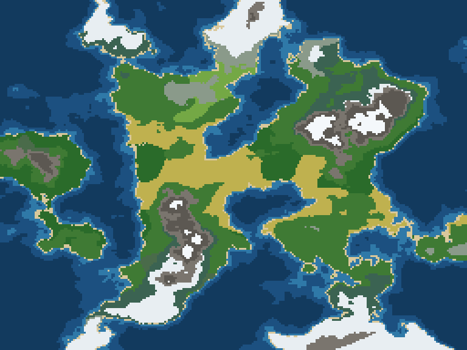

# Mundo Vivo

[](https://github.com/Lhordrixon/mundo-vivo/actions/workflows/build.yml)  



Um jogo de deus para Android: um mundo inteiro nasce de um número, e
criaturas vivem nele sozinhas. Inspirado no WorldBox, com código e arte
100% originais.

---

## 🌱 O que já funciona?

- 🌍 Mundos gerados por semente, com continentes, montanhas e biomas
- 🐾 240 criaturas que comem, se reproduzem, envelhecem e morrem
- 🌾 Comida que cresce de volta conforme a terra
- 👑 4 reinos, e criaturas de reinos diferentes brigam
- 🧬 Filhos que herdam os traços dos pais
- 👆 Um poder: tocar numa criatura a fere

📋 Paridade com o WorldBox: **32 de 217** funcionalidades (~16%).
Veja a [auditoria](docs/auditoria.md).

---

## ▶️ Como rodar?

```bash
./gradlew desktop:run
```

Abre o jogo numa janela do computador. Precisa do JDK 17 e do Android
Studio instalados.

> [!TIP]
> Primeira vez aqui? Siga o **[COMECE-AQUI.md](COMECE-AQUI.md)**. Ele leva
> do zero até o seu primeiro pull request, passo a passo.

---

## 📚 Onde está o resto?

- 🚀 **Começar do zero:** [COMECE-AQUI.md](COMECE-AQUI.md)
- 🤝 **Enviar uma mudança:** [CONTRIBUTING.md](CONTRIBUTING.md)
- 🗂️ **Entender o código:** [docs/arquitetura.md](docs/arquitetura.md)
- 🐾 **Entender a simulação:** [docs/simulacao.md](docs/simulacao.md)
- 🧬 **Entender a genética:** [docs/genetica.md](docs/genetica.md)
- 👑 **Entender reinos e território:** [docs/faccoes.md](docs/faccoes.md)
- ✅ **Rodar os testes:** [docs/verificacao.md](docs/verificacao.md)
- 🧭 **Saber o que falta:** [docs/divida-tecnica.md](docs/divida-tecnica.md)

---

Todos os direitos reservados. Veja [CONTRIBUTING.md](CONTRIBUTING.md) antes
de contribuir.
