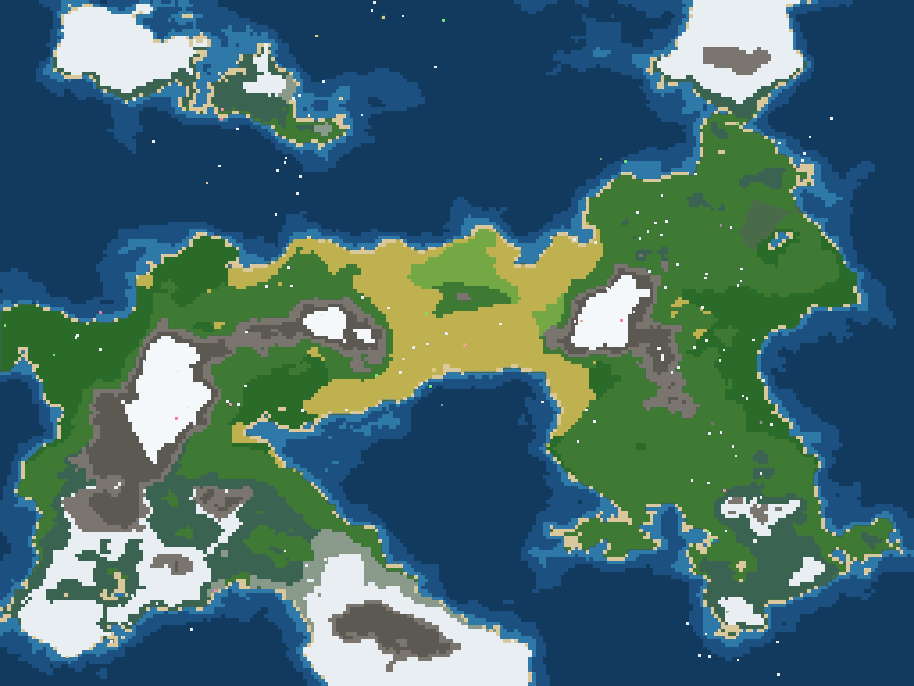
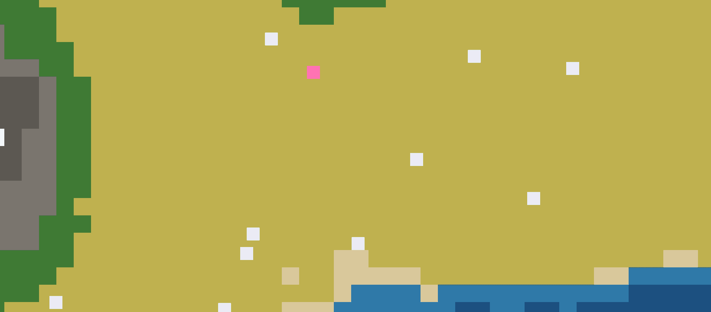
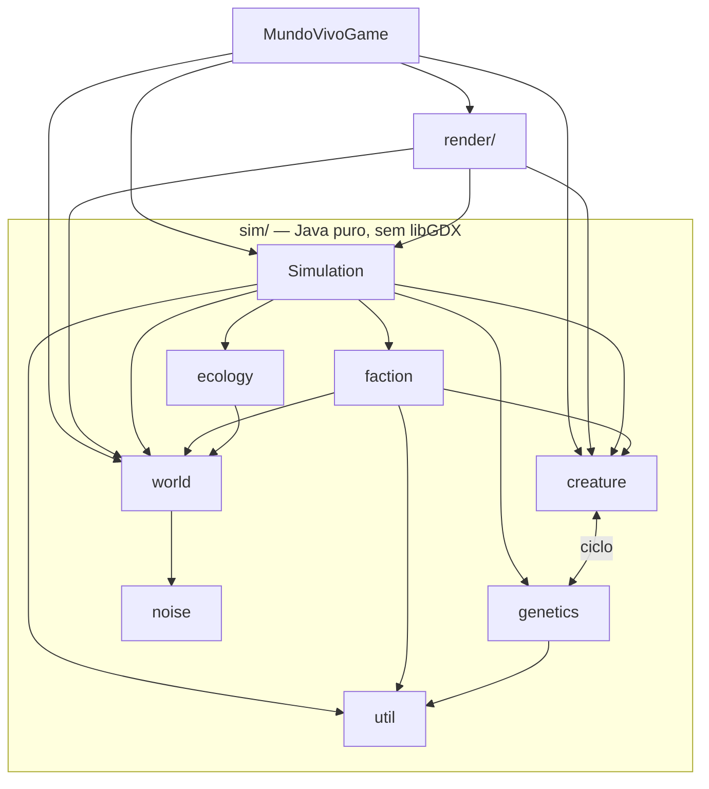

# Mundo Vivo

[](https://github.com/Lhordrixon/mundo-vivo/actions/workflows/build.yml)   


<sub>Mundo gerado por semente, rodando no Android.</sub>

Um jogo de deus para Android: um mundo inteiro nasce de um número, e
criaturas vivem nele sozinhas, comem, têm filhos e brigam entre reinos.

---

## O que existe hoje?

🟢 implementado e testado · 🔵 implementado, sem consumidor na tela ·
🟡 parcial · ⚪ planejado · 🔴 problema conhecido

- 🌍 **Mundo** — 🟢 implementado e testado. Continentes, montanhas e 16
  tipos de terreno. A mesma semente gera sempre o mesmo mundo.
- 🌱 **Ecologia** — 🟢 implementado e testado. A comida cresce de volta
  conforme a fertilidade de cada terreno.
- 🐾 **Criaturas** — 🟢 implementado e testado. Procuram comida e
  parceiro, se reproduzem, envelhecem e morrem.
- 🧬 **Genética** — 🟢 implementado e testado. Filhos herdam dos pais a
  velocidade, a visão, o metabolismo e a longevidade.
- 👑 **Facções** — 🟡 parcial. Toda criatura nasce num reino. Nome, cor e
  território existem, mas ainda não aparecem na tela.
- ⚔️ **Combate** — 🟢 implementado e testado. Criaturas de reinos
  diferentes se ferem quando ficam perto.
- ✋ **Jogador** — 🟡 parcial. Há um poder só: tocar numa criatura a fere.
- 🎨 **Desenho** — 🟡 parcial. Terreno e criaturas, sem interface nem
  sprites.
- ⚙️ **Salvar e carregar** — ⚪ planejado.


<sub>De perto, cada quadrado é uma criatura. A cor diz o que ela está
fazendo: **branco**, vagando; **amarelo**, procurando comida; **verde**,
comendo; **rosa**, procurando parceiro.</sub>

O que falta, item por item, está no [roadmap](docs/roadmap.md).

---

## 🚀 Como eu experimento?

**No celular:** baixe o
[**mundo-vivo.apk** da última versão](https://github.com/Lhordrixon/mundo-vivo/releases/latest/download/mundo-vivo.apk),
sem precisar de login, e abra o arquivo. As versões anteriores ficam em
[Releases](https://github.com/Lhordrixon/mundo-vivo/releases).

**No computador:** precisa do JDK 17 e do Android Studio instalados.

```bash
./gradlew desktop:run
```

**Rodar os testes:**

```bash
./gradlew core:test
```

> [!TIP]
> Primeira vez aqui? Siga o **[COMECE-AQUI.md](COMECE-AQUI.md)**. Ele leva
> do zero até o seu primeiro pull request, passo a passo.

---

## ⚙️ Como o código se organiza?

Toda a simulação fica em `sim/`, em Java puro. O desenho fica em
`render/`, a única parte que usa o libGDX. As setas dizem quem usa quem:



`creature` e `genetics` dependem uma da outra: é um ciclo conhecido.
Combate e o poder do jogador ainda não têm pacote próprio. Moram dentro
de `Simulation.java`.

---

## Onde está o resto?

- **Começar do zero:** [COMECE-AQUI.md](COMECE-AQUI.md)
- **Enviar uma mudança:** [CONTRIBUTING.md](CONTRIBUTING.md)
- **Como as peças se encaixam:** [arquitetura](docs/arquitetura.md) e
  [decisões](docs/decisoes/README.md)
- **Cada domínio:** 🌍 [mundo](docs/dominios/mundo.md) ·
  🌱 [ecologia](docs/dominios/ecologia.md) ·
  🐾 [criaturas, combate e jogador](docs/dominios/criaturas.md) ·
  🧬 [genética](docs/dominios/genetica.md) ·
  👑 [facções](docs/dominios/faccoes.md)
- 🧪 **Testes, ferramentas e números:** [verificação](docs/verificacao.md)
- **O que está pendente:** [dívida técnica](docs/divida-tecnica.md)
- **O que existe e o que falta:** [roadmap](docs/roadmap.md)

---

Todos os direitos reservados. Veja o [CONTRIBUTING.md](CONTRIBUTING.md)
antes de contribuir.
