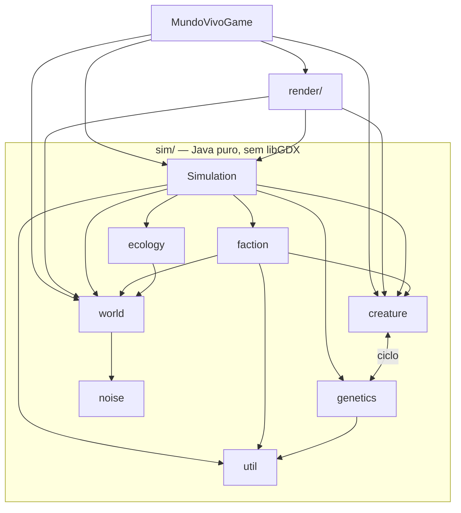
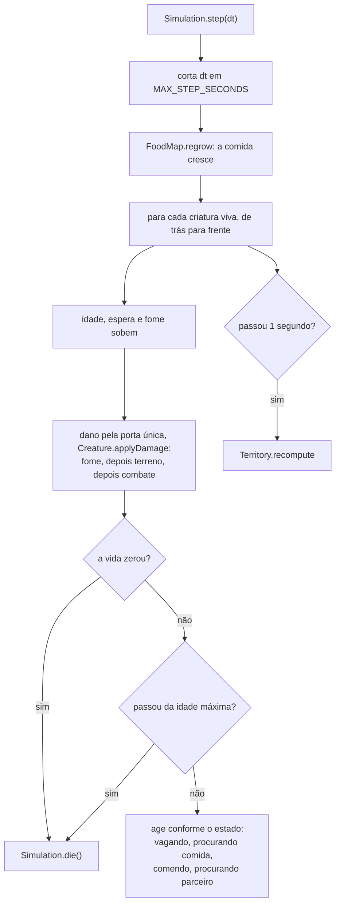
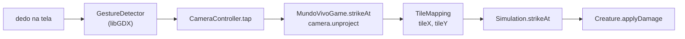

# Arquitetura

Como o código está dividido, o que acontece em um passo da simulação e
como um toque na tela chega até uma criatura.

**Em resumo:** a simulação (`sim/`) é Java puro e não sabe que existe
tela. O desenho (`render/`) é a única parte que usa o libGDX. Tudo nasce
de uma semente: o mesmo número gera sempre o mesmo mundo.

> [!NOTE]
> **libGDX** é a biblioteca que desenha na tela e lê o toque. **APK** é o
> arquivo que se instala no Android.

---

## Quais são as camadas?

| Camada | Onde | Usa libGDX? | Testável sem tela? |
|---|---|---|---|
| Simulação | `core/.../sim/` | não | sim |
| Desenho e entrada | `core/.../render/` | sim, menos `TileMapping` | só `TileMapping` e parte da câmera |
| Cola | `core/.../MundoVivoGame.java` | sim | não |
| Lançadores | `android/`, `desktop/` | sim | não |
| Ferramentas | `tools/` | não | sim, só com o JDK |

```
core/
  sim/              simulação pura — nenhuma linha de libGDX
    Simulation.java o passo de vida, o combate e o poder do jogador
    creature/       criatura, estados, espécie, pool, parâmetros
    ecology/        comida por tile e rebrota
    faction/        reinos e território
    genetics/       genoma, herança e traços
    noise/          ruído fractal determinístico
    world/          tipos de tile, configuração, mundo, gerador
    util/           sorteador determinístico
  render/           desenho, câmera e toque
android/            abre o jogo no celular e monta o APK
desktop/            abre o jogo numa janela do PC
tools/              ferramentas em Java puro, sem Gradle
```

---

## Quem depende de quem?

As setas dizem "usa". Elas saem dos `import` do código, não de intenção.



- **O ciclo `creature` ⇄ `genetics` é real.** `Creature` guarda um genoma
  do tamanho de `Genome.BLOCKS`, e `Phenotype` lê `Creature` e
  `CreatureConfig` para escrever os traços na criatura.
  Quebrar o ciclo está proposto em [dívida técnica](divida-tecnica.md).
- **Combate e jogador não têm pacote.** Moram em `Simulation.java`
  (`hostileNeighbours` e `strikeAt`).

---

## O que acontece em um passo?

`Simulation.step(dt)` roda uma vez por quadro. `dt` é o tempo desde o
quadro anterior, em segundos.



`Simulation.die()` é o único caminho de morte: o corpo vira comida, a
criatura sai do reino e o slot volta ao pool.

O laço anda de trás para frente de propósito. Uma morte troca a criatura
com a última da lista, e um nascimento entra no fim. Nesse sentido,
ninguém é pulado nem processado duas vezes.

---

## Como um toque chega até a criatura?



| Trecho | Quem faz | Dá para testar sem tela? |
|---|---|---|
| dedo → ponto na tela | `GestureDetector`, do libGDX | não |
| tela → ponto no mundo | `camera.unproject` | não |
| mundo → tile | `TileMapping` | **sim** (`TileMappingTest`) |
| tile → criatura ferida | `Simulation.strikeAt` | **sim** (`SimulationTest`) |

O `CameraController` só entrega o toque em pixels de tela. Ele não sabe o
que existe no mundo. Quem junta câmera, desenho e simulação é o
`MundoVivoGame`.

A conta de tela para tile mora em `TileMapping`, fora do `WorldRenderer`,
para poder ser testada sem placa de vídeo. O teste mais importante faz a
ida e volta: onde o `CreatureRenderer` desenha uma criatura é onde o toque
a encontra.

---

## Por que o código é assim?

Cada decisão grande tem um registro curto em [decisões](decisoes/):

- [Simulação sem libGDX](decisoes/0001-simulacao-sem-libgdx.md)
- [Mundo em arrays planos](decisoes/0002-arrays-planos.md)
- [Mundo desenhado como textura](decisoes/0003-mundo-como-textura.md)
- [Determinismo pela semente](decisoes/0004-determinismo-por-semente.md)
- [Genoma em blocos](decisoes/0005-genoma-em-blocos.md)
- [Poucos reinos contíguos](decisoes/0006-poucos-reinos-contiguos.md)
- [240 fundadores](decisoes/0007-240-fundadores.md)
- [Porta única de dano](decisoes/0008-porta-unica-de-dano.md)
- [Nomes secos de espécie](decisoes/0009-nomes-secos-de-especie.md)

---

## Que versões o projeto usa?

Todas ficam em `gradle.properties`.

| Componente | Versão | Por quê |
|---|---|---|
| libGDX | 1.14.2 | versão estável atual |
| Android Gradle Plugin | 8.13.0 | exige Gradle 8.13+ e JDK 17+ |
| Gradle (wrapper) | 8.14.3 | satisfaz o mínimo do plugin do Android |
| compileSdk / targetSdk | 36 | máximo suportado pelo plugin 8.13 |
| minSdk | 26 | Android 8; permite ícone adaptativo em XML puro |
| Java (fonte e destino) | 17 | sem backend HTML no projeto, não há motivo para ficar no 8 |

> [!WARNING]
> O Android Studio pode oferecer atualizar o plugin do Android para a
> série 9.x. A série 9 muda a forma de escrever o build. Se aceitar, faça
> num commit separado, para poder voltar atrás.

<details>
<summary>Comandos de build do Android</summary>

```bash
./gradlew android:assembleDebug
# sai em: android/build/outputs/apk/debug/android-debug.apk

./gradlew android:installDebug   # instala no celular ligado por USB
```

Cada tag `v*` enviada ao GitHub dispara `.github/workflows/release.yml`,
que testa, compila o APK de depuração e cria uma Release com ele anexado,
com o nome fixo `mundo-vivo.apk`.

Para o APK de release é preciso criar uma chave de assinatura e declará-la
em `android/build.gradle`. Sem isso, `assembleRelease` gera um APK não
assinado, que o Android recusa instalar.

Na primeira execução o Gradle baixa o libGDX e o plugin do Android:
precisa de internet. Até o `desktop:run` precisa do SDK do Android, porque
o `build.gradle` da raiz carrega o plugin do Android para todos os módulos.

</details>

<details>
<summary>Os sistemas, na ordem em que foram construídos</summary>

| Sistema | Situação |
|---|---|
| 1. Grade de tiles e geração de mundo | pronto e testado |
| 2. Câmera com arraste, pinça e roda do mouse | pronto |
| 3. Criaturas com máquina de estados | pronto e testado |
| 3b. Comida por tile, com rebrota | pronto e testado |
| 3c. Pool de criaturas sem alocação | pronto e testado |
| 4. Facções e território | pronto e testado |
| 4b. Nome e cor por facção | pronto e testado, sem consumidor na tela |
| 4c. Fundação de reinos contíguos | pronto e testado |
| 4d. Genoma de blocos, herdável | pronto e testado |
| 5. Save/load | não começou |
| 6. Poderes de deus | não começou |
| 7. IA de guerra | não começou |
| 8. Passo de otimização e medição de FPS | não começou |
| 9. Dano externo e terreno perigoso | pronto e testado |
| 10. Primeiro poder do jogador: toque que fere | pronto e testado |
| 11. Espécie herdável, com acasalamento restrito | pronto e testado |
| 12. Combate corpo a corpo entre reinos | pronto e testado |

O estado de cada funcionalidade, item a item, está no
[roadmap](roadmap.md).

</details>
